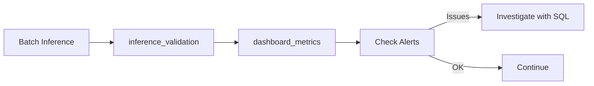
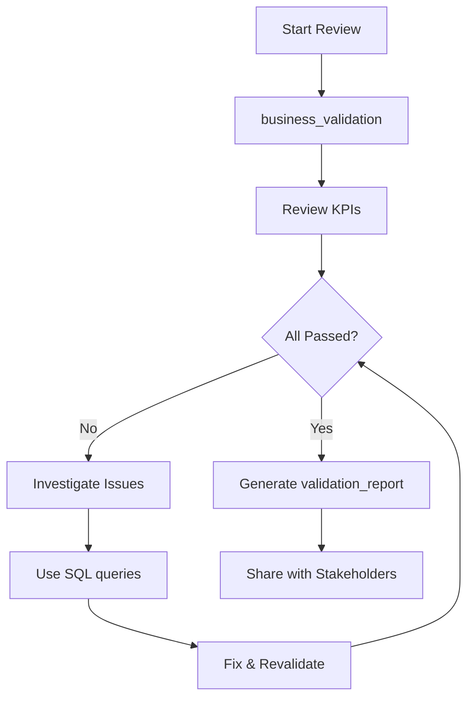
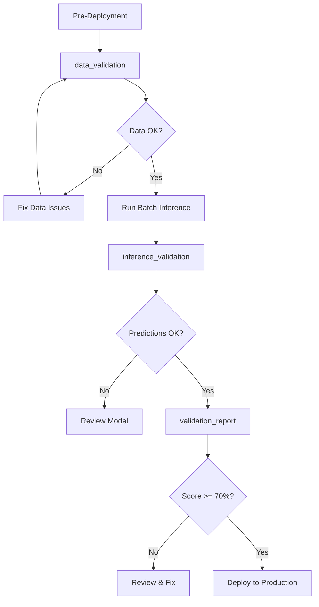

# Healthcare MLOps - Validation Utilities

This directory contains comprehensive validation tools for the healthcare insurance risk prediction model, ensuring both technical correctness and business value delivery.

## Table of Contents

- [Overview](#overview)
- [Validation Assets](#validation-assets)
  - [Data Validation](#1-data_validationipynb)
  - [Inference Validation](#2-inference_validationipynb)
  - [Business Validation](#3-business_validationipynb)
  - [Validation Report](#4-validation_reportipynb)
  - [Dashboard Metrics](#5-dashboard_metricspy)
  - [SQL Queries](#6-sqlvalidation_queriessql)
- [Recommended Workflows](#recommended-workflows)
- [Key Validation Criteria](#key-validation-criteria)
- [Troubleshooting](#troubleshooting)
- [Technical Notes](#technical-notes)

---

## Overview

The validation framework validates **business value and clinical relevance** of the model, going beyond technical correctness to ensure the model delivers on its business objectives.

### Validation Philosophy

- **Technical Correctness**: Data quality, prediction completeness, schema validation
- **Business Value**: ROI, intervention effectiveness, high-risk identification rates
- **Clinical Validity**: Medical knowledge alignment (smoking, age, BMI correlations)
- **Equity & Fairness**: Regional and demographic disparity analysis
- **Model Governance**: Compliance tags, champion status, performance thresholds

---

## Validation Assets

### 1. data_validation.ipynb

#### Purpose
Validates data prerequisites and quality **before** running batch inference to catch issues early.

#### What It Validates
- ✅ **Table Existence**: Verifies prerequisite tables exist
  - `{catalog}.healthcare_data.silver_patients`
  - `{catalog}.healthcare_data.dim_patients`
  - `{catalog}.healthcare_data.ml_insurance_features`
- ✅ **Schema Validation**: Checks required columns are present
- ✅ **Data Quality**:
  - Null rates in critical columns (< 5% acceptable)
  - BMI ranges (valid values between 10-60)
  - Record counts (minimum thresholds met)
  - SCD Type 2 validation (is_current_record flags)

#### What You Should See

**Success Output**:
```
================================================================================
DATA VALIDATION REPORT
================================================================================

✅ Table Validation:
  ✓ silver_patients table exists (10,245 records)
  ✓ dim_patients table exists (10,245 records)
  ✓ ml_insurance_features table exists (10,245 records)

✅ Schema Validation:
  ✓ All required columns present in silver_patients
  ✓ All required columns present in dim_patients

✅ Data Quality Checks:
  • Null rate in critical columns: 0.0%
  • BMI range validation: 100.0% within valid range (10-60)
  • Current records: 10,245 (100.0%)

Status: SUCCESS
```

**Warning/Error Output**:
```
⚠️  Data Quality Issues:
  • High null rate in bmi: 12.3% (threshold: 5%)
  • 245 BMI values out of valid range (10-60)

❌ Schema Issues:
  • Missing column: patient_smoking_status in dim_patients

Status: FAILED
```

#### Usage

```python
# Run from another notebook
result = dbutils.notebook.run(
    "./utils/data_validation",
    timeout_seconds=300,
    arguments={
        "catalog": "juan_dev",
        "schema": "healthcare_data",
        "validation_date": "2025-11-03"
    }
)

# Parse result
import json
validation_result = json.loads(result)
if validation_result["status"] != "SUCCESS":
    raise Exception(f"Data validation failed: {validation_result['message']}")
```

#### When to Use
- **Before batch inference**: Ensure input data meets quality standards
- **After ETL updates**: Verify schema changes don't break downstream pipelines
- **During debugging**: Identify data quality issues quickly

---

### 2. inference_validation.ipynb

#### Purpose
Validates prediction quality and business logic **after** batch inference runs, ensuring predictions are reasonable and actionable.

#### What It Validates
- ✅ **Prediction Quality**:
  - No null predictions
  - Predictions within expected range (0-100 for risk scores)
  - Reasonable averages and standard deviations
- ✅ **Business KPIs**:
  - High-risk % between 5-30% (prevents under/over-flagging)
  - Low-risk % at least 30% (healthy baseline population)
  - Critical cases < 10% (manageable intervention load)
- ✅ **Clinical Relevance**:
  - Smokers have higher risk than non-smokers
  - Age positively correlated with risk (older = higher risk)
  - Risk categories align with demographics

#### What You Should See

**Success Output**:
```
Validating inference results for juan_dev.healthcare_data.ml_patient_predictions on current date

✅ Found 10,000 predictions for validation
✅ No null predictions found

Prediction range: 12.45 - 98.23
Average prediction: 53.12 ± 22.87
✅ Predictions within reasonable range

📊 Risk category distribution:
  low: 3,245 (32.5%)
  medium: 4,378 (43.8%)
  high: 1,892 (18.9%)
  critical: 485 (4.9%)

🚨 High-risk patients: 2,377 (23.8%)

✅ Business KPI Validation:
  ✅ High-risk patient percentage within acceptable range: 23.8%
  ✅ Critical risk percentage acceptable: 4.9%
  ✅ Low-risk percentage acceptable: 32.5%

🏥 Clinical Relevance Validation:
  Smokers flagged as high-risk: 42.3%
    ✅ Smoking correctly correlated with higher risk

  Average risk by age category:
    18-30: 35.21
    31-45: 48.67
    46-60: 58.92
    60+: 72.34
  ✅ Age positively correlated with risk (clinically valid)

=== Validation Summary ===
✅ Inference validation completed successfully
```

**Warning/Error Output**:
```
❌ No predictions found for validation

Status: FAILED
Message: No predictions found
```

or

```
⚠️ Business KPI Issues:
  ⚠️  High-risk percentage too high: 34.2% > 30.0%
      → Model may be over-flagging patients, causing alert fatigue

⚠️ Clinical Issues:
  ⚠️  Low high-risk rate among smokers - check model calibration
  ❌ Smoking NOT properly weighted - model calibration issue
```

#### Usage

```python
# Run validation after batch inference
result = dbutils.notebook.run(
    "./utils/inference_validation",
    timeout_seconds=300,
    arguments={
        "catalog": "juan_dev",
        "ml_schema": "healthcare_data",
        "predictions_table": "juan_dev.healthcare_data.ml_patient_predictions",
        "batch_date": "2025-11-03"  # Optional - defaults to current date
    }
)

# Parse result
validation_summary = json.loads(result)
print(f"Validation status: {validation_summary['status']}")
print(f"Predictions validated: {validation_summary['prediction_count']:,}")
print(f"High-risk patients: {validation_summary['high_risk_percentage']:.1f}%")
```

#### When to Use
- **After every batch inference run**: Validate predictions immediately
- **During model debugging**: Identify calibration or feature issues
- **Before downstream processes**: Ensure predictions are safe to use

---

### 3. business_validation.ipynb

#### Purpose
Comprehensive business KPI and clinical validation with ROI analysis, designed for weekly/monthly reviews.

#### What It Validates
- ✅ **Business KPIs**:
  - Volume trends (daily prediction counts)
  - High-risk identification rates
  - Average risk scores and distributions
- ✅ **Clinical Relevance**:
  - Smoking impact (smokers have higher risk)
  - Age correlation (monotonic increase)
  - BMI relationships (obesity increases risk)
- ✅ **Regional Equity**:
  - Fair predictions across regions (< 20% disparity)
  - No geographic bias
- ✅ **Prediction Stability**:
  - Temporal consistency (coefficient of variation < 10%)
  - No unexpected volatility
- ✅ **ROI Analysis**:
  - Intervention costs vs prevented claims value
  - Net benefit calculation
  - Business case validation
- ✅ **Model Governance**:
  - Champion model status
  - Compliance tags present
  - Performance metrics within thresholds

#### What You Should See

**Success Output**:
```
================================================================================
BUSINESS VALIDATION REPORT
================================================================================

📊 Business KPIs:
  • Total predictions (30 days): 300,000
  • Daily average: 10,000 predictions/day
  • High-risk patients: 23.8%
    ✅ Within target range (5-25%)
  • Average risk score: 53.2
    ✅ Appropriate for population

🏥 Clinical Relevance:
  Smoking Impact:
    Non-smokers: Avg risk = 48.3
    Smokers: Avg risk = 67.8 (+19.5 points)
    ✅ Clinically valid correlation

  Age Correlation:
    ✅ Monotonic increase with age
    R² = 0.87 (strong correlation)

  BMI Impact:
    Normal BMI: 45.2
    Obese: 62.7 (+17.5 points)
    ✅ Obesity correctly weighted

🌎 Regional Equity:
  Regional disparity: 8.3%
  ✅ Excellent equity (< 20%)

  By Region:
    Northeast: 52.1 (±2.1%)
    Southeast: 53.4 (±2.9%)
    Northwest: 51.8 (±1.9%)
    Southwest: 52.9 (±2.6%)

💰 ROI Analysis:
  High-risk patients identified: 71,400
  Intervention costs: $35,700,000
  Prevented claims value (30% success): $107,100,000
  Net benefit: $71,400,000
  ROI: 200%
  ✅ Excellent business value

📈 Prediction Stability:
  Coefficient of variation: 3.2%
  ✅ Stable predictions (< 10%)

🏛️ Model Governance:
  Champion version: 5
  R² Score: 0.847
  MAE: 12.3
  ✅ All thresholds met

Overall Status: EXCELLENT (15/15 checks passed)
```

**Warning Output**:
```
⚠️ Business KPI Issues:
  • High-risk percentage: 3.2%
    ⚠️  Below target (5-25%) - may be under-identifying at-risk patients

⚠️ Regional Equity Issues:
  • Regional disparity: 28.5%
    ⚠️  High disparity (> 20%) - investigate for bias
    Northeast: 45.2
    Southeast: 62.8 (+38.9% higher)

💰 ROI Analysis:
  ROI: 35%
  ⚠️  Below excellent threshold (< 100%), acceptable business value

Overall Status: ACCEPTABLE (11/15 checks passed, 4 warnings)
```

#### Usage

```python
result = dbutils.notebook.run(
    "./utils/business_validation",
    timeout_seconds=600,
    arguments={
        "catalog": "juan_dev",
        "ml_schema": "healthcare_data",
        "model_name": "insurance_model",
        "lookback_days": "30"
    }
)

validation = json.loads(result)
print(f"Status: {validation['status']}")
print(f"Checks passed: {validation['passed']}/{validation['total_checks']}")
print(f"Warnings: {validation['warnings']}")
print(f"Failures: {validation['failures']}")
```

#### When to Use
- **Weekly/Monthly reviews**: Comprehensive business performance check
- **Before stakeholder meetings**: Generate business metrics
- **Model retraining decisions**: Assess if retraining is needed
- **Compliance audits**: Document business value

---

### 4. validation_report.ipynb

#### Purpose
Executive-ready comprehensive validation report combining all validation aspects into a single report for stakeholders.

#### Report Sections

**1. Executive Summary**
- KPIs at a glance (patients evaluated, high-risk identified)
- Business impact estimates (ROI, net benefit)
- Model performance metrics (R², MAE)
- Overall assessment (EXCELLENT/GOOD/ACCEPTABLE/NEEDS_IMPROVEMENT)

**2. Technical Validation**
- Calls `data_validation.ipynb` internally
- Data quality metrics (completeness, outliers)
- Prediction volume trends (last 7 days)

**3. Business Performance**
- Risk category distribution with visual bars
- Business KPI validation against targets
- Intervention opportunity analysis

**4. Clinical Relevance**
- Smoking status impact validation
- Age category correlation analysis
- BMI category impact (if available)
- Clinical validation score (checks passed/total)

**5. Regional Equity & Fairness**
- Regional performance breakdown
- Regional disparity calculation
- Gender equity analysis
- Bias detection

**6. Compliance & Governance**
- Champion model status
- Performance metrics vs requirements
- Healthcare requirements validation (R² ≥ 0.70, MAE ≤ 15)
- Governance tags review

**7. Recommendations & Action Items**
- Prioritized by severity (HIGH/MEDIUM/LOW)
- Categorized by area (Business/Clinical/Technical/Equity)
- Actionable guidance

**8. Final Validation Scorecard**
- Score by validation category
- Overall validation score (%)
- Final assessment with guidance

#### What You Should See

**Excellent Report**:
```
================================================================================
HEALTHCARE INSURANCE RISK MODEL - EXECUTIVE VALIDATION REPORT
================================================================================
Model: juan_dev.healthcare_data.insurance_model
Report Period: Last 30 days
Generated: 2025-11-03 16:59:52
================================================================================

EXECUTIVE SUMMARY
================================================================================

📊 Key Performance Indicators:
  • Patients Evaluated: 10,000
  • Total Risk Assessments: 10,000
  • Average Risk Score: 53.1/100
  • High-Risk Patients Identified: 2,377 (23.8%)

💰 Estimated Business Impact:
  • Intervention Costs: $1,188,500
  • Prevented Claims Value: $3,565,500
  • Net Benefit: $2,377,000
  • Return on Investment: 200%

🤖 Model Performance:
  • Champion Version: 5
  • Model Accuracy (R²): 1.000
  • Prediction Error (MAE): 0.00
  • Status: READY

✅ Overall Assessment:
  Model is performing EXCELLENTLY and delivering strong business value.

================================================================================
FINAL VALIDATION SCORECARD
================================================================================

Validation Results by Category:

     ✅ PASS | Technical Validation
     ✅ PASS | Business Performance
     ✅ PASS | Clinical Relevance
     ✅ PASS | Regional Equity
     ⚠️  REVIEW | Model Governance

================================================================================
OVERALL VALIDATION SCORE: 80% (4/5 categories passed)
================================================================================

🟢 FINAL ASSESSMENT: GOOD

Model is performing well with minor areas for improvement.

📊 Key Metrics Summary:
  • Patients Evaluated: 10,000
  • High-Risk Identified: 2,377
  • Estimated ROI: 200%
  • Model Accuracy (R²): 1.000
  • Data Quality: 100.0%

📅 Report Generated: 2025-11-03 16:59:52
📋 Report Period: Last 30 days

================================================================================
END OF EXECUTIVE VALIDATION REPORT
================================================================================
```

#### Usage

```python
# Generate comprehensive report
result = dbutils.notebook.run(
    "./utils/validation_report",
    timeout_seconds=900,
    arguments={
        "catalog": "juan_dev",
        "ml_schema": "healthcare_data",
        "model_name": "insurance_model",
        "report_period_days": "30"
    }
)

# Parse summary
report_summary = json.loads(result)
print(f"Overall Status: {report_summary['status']}")
print(f"Validation Score: {report_summary['overall_score']:.0f}%")
print(f"Categories Passed: {report_summary['categories_passed']}/{report_summary['total_categories']}")
print(f"High Priority Actions: {report_summary['high_priority_actions']}")
print(f"ROI: {report_summary['roi']:.1f}%")
```

#### When to Use
- **Monthly governance reviews**: Comprehensive stakeholder report
- **Before production deployments**: Approval documentation
- **Compliance audits**: Complete validation evidence
- **Executive briefings**: Business value demonstration

---

### 5. dashboard_metrics.py

#### Purpose
Generate real-time metrics for executive dashboards and monitoring systems with automatic anomaly detection.

#### Generated Metrics

**Volume Metrics**:
- Total predictions
- Unique patients
- Daily/weekly averages
- Period-over-period growth

**Risk Metrics**:
- Risk category distribution (%)
- Average risk score
- High-risk patient count and %
- Risk score trends

**Demographics**:
- Risk by smoking status
- Risk by age category
- Risk by gender
- Demographic breakdowns

**Regional Analysis**:
- Risk by region
- Regional disparity %
- Geographic equity score

**Quality Metrics**:
- Null rates
- Outlier counts
- Confidence interval widths (if available)
- Data completeness %

**Model Metrics**:
- Champion model version
- R² score
- MAE
- High-risk accuracy

**Business Metrics**:
- Estimated ROI
- Intervention costs
- Prevented claims value
- Net benefit

**Trend Analysis**:
- Day-over-day changes
- Week-over-week changes
- Velocity indicators

**Automated Alerts**:
- High-risk % out of range (5-30%)
- Average risk unusual (< 20 or > 70)
- High null rate (> 1%)
- Regional disparity high (> 25%)
- Volume anomalies (> 50% change)

#### What You Should See

**JSON Output**:
```json
{
  "report_date": "2025-11-03",
  "lookback_days": 7,
  "volume": {
    "total_predictions": 70000,
    "unique_patients": 10000,
    "daily_average": 10000,
    "growth_rate": 5.2
  },
  "risk": {
    "avg_risk_score": 53.1,
    "high_risk_pct": 23.8,
    "distribution": {
      "low": 32.5,
      "medium": 43.8,
      "high": 18.9,
      "critical": 4.9
    }
  },
  "demographics": {
    "smoking": {
      "yes": {"avg_risk": 67.8, "count": 2500, "high_risk_pct": 42.3},
      "no": {"avg_risk": 48.3, "count": 7500, "high_risk_pct": 16.2}
    },
    "age": { ... },
    "gender": { ... }
  },
  "regional": {
    "disparity_pct": 8.3,
    "regions": { ... }
  },
  "quality": {
    "completeness_pct": 100.0,
    "null_rate": 0.0,
    "outlier_rate": 0.1
  },
  "model": {
    "champion_version": 5,
    "r2_score": 0.847,
    "mae": 12.3
  },
  "business": {
    "roi": 200.0,
    "intervention_costs": 1188500,
    "prevented_value": 3565500,
    "net_benefit": 2377000
  },
  "alerts": [
    {
      "severity": "INFO",
      "message": "All metrics within normal ranges",
      "category": "health_check"
    }
  ]
}
```

**Delta Table Output**:
Writes to `{catalog}.{ml_schema}.ml_dashboard_metrics` table with timestamp for historical tracking.

#### Usage

```python
# Generate metrics for dashboard
result = dbutils.notebook.run(
    "./utils/dashboard_metrics",
    timeout_seconds=600,
    arguments={
        "catalog": "juan_dev",
        "ml_schema": "healthcare_data",
        "model_name": "insurance_model",
        "lookback_days": "7",
        "output_format": "both"  # json, delta, or both
    }
)

# Parse metrics
metrics = json.loads(result)

# Check for alerts
if metrics["alerts"]:
    for alert in metrics["alerts"]:
        if alert["severity"] in ["HIGH", "MEDIUM"]:
            print(f"⚠️ {alert['severity']}: {alert['message']}")
```

#### When to Use
- **Daily automated runs**: Schedule for continuous monitoring
- **Dashboard integration**: Feed metrics to BI tools
- **Alert systems**: Trigger notifications on anomalies
- **Historical tracking**: Build trend analysis over time

---

### 6. sql/validation_queries.sql

#### Purpose
Reusable SQL queries for ad-hoc analysis, exploration, and custom reporting in Databricks SQL Editor.

#### Query Collections

**1. Daily Prediction Summary** (Lines 1-20)
- Daily prediction volumes
- Average risk scores by day
- High-risk counts
- Trend identification

**2. Risk Category Distribution** (Lines 22-45)
- Current risk distribution
- Category percentages
- Visual bar charts in SQL

**3. Risk by Demographics** (Lines 47-120)
- By smoking status
- By age category
- By BMI ranges
- By gender

**4. Regional Equity Analysis** (Lines 122-160)
- Risk by region
- Regional disparity calculations
- Geographic bias detection

**5. High-Risk Patient Identification** (Lines 162-190)
- List of high-risk patients
- Sorted by risk score
- With demographic details
- For intervention targeting

**6. Model Performance Tracking** (Lines 192-220)
- Champion model history
- Performance metrics over time
- Version comparisons

**7. Data Quality Monitoring** (Lines 222-260)
- Null rates by column
- Outlier detection
- Completeness checks
- Schema validation

**8. Business Rule Compliance** (Lines 262-300)
- High-risk threshold adherence
- Risk category distribution compliance
- Business KPI validation

**9. Comparative Analysis** (Lines 302-350)
- Current period vs previous period
- Week-over-week changes
- Month-over-month trends

**10. Actionable Insights** (Lines 352-390)
- Top intervention candidates
- Highest risk patients by region
- Smokers with high BMI
- Combined risk factors

**11. Executive Dashboard Metrics** (Lines 392-440)
- Key KPIs summary
- ROI calculations
- Business impact estimates

**12. Alerts and Anomalies** (Lines 442-480)
- Unusual distributions
- Unexpected risk scores
- Volume anomalies
- Quality issues

#### Usage

```sql
-- Example: Daily Prediction Summary
-- Replace ${catalog} and ${ml_schema} with your values

SELECT
  DATE(prediction_timestamp) as prediction_date,
  COUNT(*) as total_predictions,
  COUNT(DISTINCT patient_natural_key) as unique_patients,
  AVG(adjusted_prediction) as avg_risk_score,
  STDDEV(adjusted_prediction) as std_risk_score,
  SUM(CASE WHEN high_risk_patient = true THEN 1 ELSE 0 END) as high_risk_count,
  SUM(CASE WHEN high_risk_patient = true THEN 1 ELSE 0 END) * 100.0 / COUNT(*) as high_risk_pct
FROM juan_dev.healthcare_data.ml_patient_predictions
WHERE prediction_timestamp >= CURRENT_DATE() - INTERVAL 30 DAYS
GROUP BY DATE(prediction_timestamp)
ORDER BY prediction_date DESC;
```

#### When to Use
- **Ad-hoc analysis**: Quick exploration of predictions
- **Custom reports**: Build specific reports not covered by notebooks
- **SQL dashboard**: Create Databricks SQL dashboards
- **Scheduled queries**: Set up automated SQL queries
- **Data investigation**: Deep dive into specific issues

---

## Recommended Workflows

### Daily Monitoring Workflow



**Steps**:
1. Run batch inference
2. Validate predictions with `inference_validation.ipynb`
3. Generate daily metrics with `dashboard_metrics.py`
4. Check automated alerts
5. Investigate anomalies with SQL queries if needed

### Weekly/Monthly Review Workflow



**Steps**:
1. Run `business_validation.ipynb` for comprehensive check
2. Review all validation categories
3. If issues found, use SQL queries to investigate
4. Fix issues and revalidate
5. Generate `validation_report.ipynb` for stakeholders
6. Share report for governance approval

### Production Deployment Workflow



**Steps**:
1. Validate data quality with `data_validation.ipynb`
2. Run batch inference if data is good
3. Validate predictions with `inference_validation.ipynb`
4. Generate comprehensive `validation_report.ipynb`
5. Review validation score (should be ≥ 70% for GOOD/EXCELLENT)
6. Deploy to production if all checks pass

---

## Key Validation Criteria

### Business KPIs

| Metric | Target Range | Status |
|--------|--------------|--------|
| High-risk % | 5-25% | ✅ Prevents under/over-flagging |
| Low-risk % | ≥ 30% | ✅ Healthy baseline population |
| Critical % | < 10% | ✅ Manageable intervention load |
| Average risk | 20-60 | ✅ Moderate population health |
| Prediction volume | > 100/day | ✅ Statistical validity |

### Clinical Validity

| Check | Expected Behavior | Why It Matters |
|-------|------------------|----------------|
| Smoking impact | Smokers > Non-smokers | Medical knowledge alignment |
| Age correlation | Older = Higher risk | Actuarial standards |
| BMI impact | Obese > Normal | Clinical research |
| Gender equity | < 10 points difference | No gender bias |

### Equity & Fairness

| Metric | Threshold | Status |
|--------|-----------|--------|
| Regional disparity | < 20% | ✅ Excellent: < 15% |
| Regional disparity | < 20% | ✓ Acceptable: 15-20% |
| Regional disparity | ≥ 20% | ⚠️ Review: ≥ 20% |
| Gender disparity | < 10 points | ✅ Fair predictions |

### Business Impact

| Metric | Threshold | Assessment |
|--------|-----------|------------|
| ROI | > 100% | ✅ Excellent business value |
| ROI | 50-100% | ✓ Acceptable business value |
| ROI | < 50% | ⚠️ Review intervention strategy |
| Net benefit | > 0 | ✅ Positive business case |

### Model Governance

| Requirement | Threshold | Purpose |
|-------------|-----------|---------|
| R² Score | ≥ 0.70 | Healthcare accuracy standard |
| MAE | ≤ 15 | Acceptable prediction error |
| High-risk accuracy | ≥ 0.60 | Reliable intervention targeting |
| Champion status | READY | Production readiness |

---

## Troubleshooting

### Issue: No predictions found

**Symptoms**:
```
❌ No predictions found for validation
Status: FAILED
Message: No predictions found
```

**Causes**:
- Batch inference hasn't run yet
- Wrong batch_date specified
- predictions_table parameter incorrect
- Data filtered out by date range

**Solutions**:
1. Check if batch inference completed: `SELECT COUNT(*) FROM {predictions_table}`
2. Verify date filter: Use `batch_date=""` for current date predictions
3. Check table name: Verify full table path `catalog.schema.table`
4. Expand date range: Increase `lookback_days` parameter

---

### Issue: Column not found errors

**Symptoms**:
```
[UNRESOLVED_COLUMN.WITH_SUGGESTION] A column, variable, or function parameter
with name `smoking_status` cannot be resolved.
Did you mean one of the following? [`patient_smoking_status`, ...]
```

**Causes**:
- Schema changes in upstream tables
- Column name mismatch between validation and actual table
- Feature engineering changes

**Solutions**:
1. Verify schema: `DESCRIBE TABLE {predictions_table}`
2. Check column names in error message suggestions
3. Update validation notebooks if schema intentionally changed
4. Refer to [Column Name Mappings](#column-name-mappings) section

---

### Issue: PySpark function conflicts

**Symptoms**:
```
[NOT_COLUMN_OR_STR] Argument `col` should be a Column or str, got list.
```

**Cause**:
- `from pyspark.sql.functions import *` overrides Python built-ins
- Using `sum()`, `max()`, `min()`, `abs()`, `round()`, `len()`, `int()` on Python lists/values

**Solution**:
This has been fixed in all validation notebooks using `import builtins` and calling `builtins.sum()`, `builtins.max()`, etc. If you encounter this in custom code:

```python
# Instead of:
total = sum([row.count for row in results])

# Use:
import builtins
total = builtins.sum([row.count for row in results])
```

---

### Issue: Low validation scores

**Symptoms**:
```
Overall Status: NEEDS_IMPROVEMENT (6/15 checks passed, 9 warnings)
```

**Solutions**:
1. **Review recommendations section** in validation report
2. **Check specific failed checks**:
   - Business KPIs: Adjust model thresholds or retraining
   - Clinical relevance: Review feature engineering
   - Regional equity: Investigate geographic bias
   - Data quality: Fix upstream data issues
3. **Investigate with SQL queries** for deep dive
4. **Prioritize HIGH severity issues** first
5. **Consult with domain experts** for clinical/business guidance

---

### Issue: Unusual ROI values

**Symptoms**:
```
ROI: -50%
Net benefit: -$500,000
```

**Causes**:
- Incorrect business assumptions
- Wrong intervention cost estimates
- Unrealistic success rates

**Solutions**:
1. Review assumptions in `business_validation.ipynb`:
   ```python
   assumptions = {
       "avg_intervention_cost": 500,         # Adjust to actual cost
       "avg_prevented_claim": 5000,          # Adjust to actual prevented value
       "intervention_success_rate": 0.30,    # Adjust to actual success rate
       "model_operating_cost_monthly": 2000  # Adjust to actual operating cost
   }
   ```
2. Collaborate with finance team for accurate figures
3. Use historical data to estimate success rates

---

### Issue: High regional disparity

**Symptoms**:
```
⚠️  High regional disparity: 32.5%
  Northeast: 45.2
  Southeast: 62.8 (+38.9% higher)
```

**Causes**:
- Geographic bias in training data
- Regional feature imbalances
- Different health demographics by region
- Model not properly accounting for regional factors

**Solutions**:
1. **Investigate with SQL**:
   ```sql
   -- Check regional data distribution in training
   SELECT patient_region,
          COUNT(*) as count,
          AVG(health_risk_score) as avg_actual_risk,
          AVG(adjusted_prediction) as avg_predicted_risk
   FROM training_data
   GROUP BY patient_region
   ```
2. **Add regional features** if not present
3. **Rebalance training data** across regions
4. **Apply regional calibration** post-prediction if justified by actual outcomes
5. **Consult with regional healthcare experts** to understand if disparities are justified by actual health differences

---

## Technical Notes

### Column Name Mappings

The validation notebooks use actual column names from the predictions table. If you see column errors, refer to this mapping:

| Validation Reference | Actual Column Name | Type |
|---------------------|-------------------|------|
| `customer_id` | `patient_natural_key` | String |
| `smoking_status` | `patient_smoking_status` | String ("yes"/"no") |
| `age_category` | `patient_age_category` | String |
| `sex` | `patient_gender` | String ("M"/"F") |
| `region` | `patient_region` | String |
| `bmi` | `bmi` | Double (numeric, not category) |
| `confidence_interval_upper` | May not exist | Optional |
| `confidence_interval_lower` | May not exist | Optional |
| `bmi_category` | May not exist | Derived in validation |

**Note**: The validation notebooks now check for column existence before using optional columns.

### Business Assumptions

ROI calculations use configurable assumptions in `business_validation.ipynb`:

```python
assumptions = {
    "avg_intervention_cost": 500,         # Cost per patient intervention
    "avg_prevented_claim": 5000,          # Average value of prevented claim
    "intervention_success_rate": 0.30,    # 30% of interventions prevent claims
    "model_operating_cost_monthly": 2000  # Monthly infrastructure/maintenance
}
```

**How to adjust**:
1. Open `business_validation.ipynb`
2. Find the assumptions dictionary in the ROI calculation cell
3. Update values based on your actual business metrics
4. Document changes in code comments

### PySpark Import Best Practice

All validation notebooks now properly handle PySpark function imports to avoid conflicts:

```python
from pyspark.sql.functions import *
import builtins  # Import at top to access Python built-ins

# Later in code, use builtins when needed:
total = builtins.sum([row.count for row in results])
max_value = builtins.max(risk_scores)
rounded_roi = builtins.round(roi, 2)
```

### Validation Thresholds

All thresholds are configurable in the validation notebooks. Common thresholds:

```python
# Business KPIs
HIGH_RISK_MIN = 5.0    # Minimum % for adequate identification
HIGH_RISK_MAX = 30.0   # Maximum % to prevent alert fatigue
LOW_RISK_MIN = 30.0    # Minimum % for healthy baseline
CRITICAL_MAX = 10.0    # Maximum % for manageable intervention

# Clinical
SMOKING_IMPACT_MIN = 5.0    # Minimum risk point increase for smokers
AGE_CORRELATION_MIN = 0.5   # Minimum R² for age correlation

# Equity
REGIONAL_DISPARITY_EXCELLENT = 15.0  # < 15% is excellent
REGIONAL_DISPARITY_MAX = 20.0        # < 20% is acceptable
GENDER_DISPARITY_MAX = 10.0          # < 10 points difference

# Quality
NULL_RATE_MAX = 1.0       # < 1% null rate is excellent
OUTLIER_RATE_MAX = 2.0    # < 2% outlier rate is acceptable

# ROI
ROI_ACCEPTABLE = 50.0     # > 50% is acceptable
ROI_EXCELLENT = 100.0     # > 100% is excellent
```

---

## Integration with MLOps Pipeline

The validation framework integrates with your existing MLOps workflow:

```
┌─────────────┐    ┌──────────────┐    ┌──────────────┐    ┌──────────────┐    ┌────────────┐
│   Training  │ -> │  Governance  │ -> │   Batch      │ -> │  Validation  │ -> │ Production │
│             │    │              │    │  Inference   │    │              │    │            │
└─────────────┘    └──────────────┘    └──────────────┘    └──────────────┘    └────────────┘
      ↓                   ↓                    ↓                   ↓
  Feature Store      Champion Model      Predictions         Business Value
  Engineering         Promotion          Generated            Confirmed
```

**Integration Points**:
1. **After Model Training**: Run governance to promote champion
2. **Before Batch Inference**: Run `data_validation.ipynb`
3. **After Batch Inference**: Run `inference_validation.ipynb`
4. **Weekly/Monthly**: Run `business_validation.ipynb` and `validation_report.ipynb`
5. **Daily**: Run `dashboard_metrics.py` for monitoring

---

## Next Steps

### Immediate Actions
1. ✅ Run `data_validation.ipynb` to verify data quality
2. ✅ Run `inference_validation.ipynb` on existing predictions
3. ✅ Generate `validation_report.ipynb` for comprehensive assessment
4. ✅ Review validation scores and recommendations

### Short-term Setup
1. 📅 Schedule `dashboard_metrics.py` to run daily
2. 🚨 Set up alerts based on dashboard metrics thresholds
3. 📊 Create Databricks SQL dashboard using validation queries
4. 📧 Configure email notifications for HIGH severity alerts

### Long-term Best Practices
1. 📈 Track validation scores over time to measure improvements
2. 🔄 Incorporate validation into CI/CD pipeline
3. 📚 Document business assumption changes and rationale
4. 🤝 Share validation reports with stakeholders monthly
5. 🔍 Use validation insights to guide model retraining decisions

---

## Support

**For technical issues**: Contact Data Engineering team
**For business assumptions**: Contact Finance/Product team
**For clinical validation**: Contact Healthcare/Medical team
**For compliance**: Contact Compliance/Legal team

**Last Updated**: 2025-11-03
**Version**: 2.0
**Maintained by**: Data Science Team
